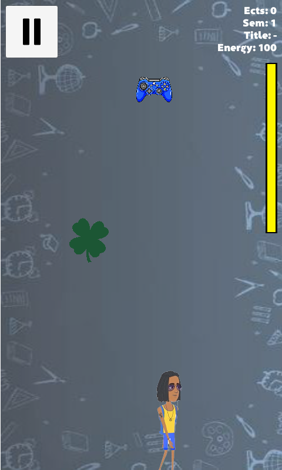

# RunStudentRun Project

Academic project, which is an implementation of mobile game intended for Android. You can check it out [here](https://play.google.com/store/apps/details?id=com.pepegastudio.runstudentrun).

## Screenshots

## Mechanics

The game is simple. You as a student, can move to the left or to the right. Items, with special meaning, fall from the sky. There are 3 types of items, which:
    
    * increase the energy
    * decrease the energy
    * gives ECTS points

You start with 100 points of energy, and you finish your game when it will decrease to 0. The goal is to survive as long as possible and catch ECTS points at the same time. It results in higher score in the end of game and receiving coins. Except for coins you have also knowledge points, which play the role of premium currency. As a student you can help yourself by using one of 3 boosts:
    
    * Kebab - increase energy by 20
    * Dean's office insurance - gives inviolability for 10 sec
    * Deadline - accelerates student for 10 sec

## Monetization system

In the shop you can buy boosts or skins for coins or knowledge points. It is common to receive coints after each game. Knowledge points can be dropped during the game, but it is only the chance of 1%. Another way to get this is to buy it for real money - here for polish currency PLN. The next aspect in this system is Loot Box. It allows to draw some boosts or skin one a day. One a day you can also watch the ad to be allowed to draw one more time. The game gives you the posibility to watch the 30 sec ad after the game, it gives you the chance to continue the lost game. After every game the ad is run, which you can close after 5 sec.